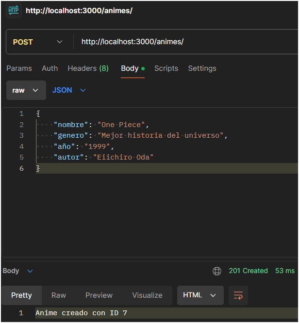

# CRUD de un JSON
## Desafío Módulo 6 FSJS.
Las instrucciones son las siguientes:
- Crear un servidor con node
- Crear un archivo index.js desde donde ingresaremos la lógica
- Crear un archivo anime.js con los datos entregados
- Crear el CRUD en index.js. El ID será el primer argumento para acceder a las propiedades de cada animé.
- Se debe poder listar todos los datos del archivo y, además, leer los datos de uno en específico, accediendo por su id y/o nombre
- Tests desde postman

---
### Paso a paso
- Iniciar `npm i express fs -y`

  


- Crear index.js y anime.json
  - contenidos de anime.json
```
  {
    "1": {
    "nombre": "Akira",
    "genero": "Seinen",
    "año": "1988",
    "autor": "Katsuhiro Otomo"
    },
    "2": {
    "nombre": "Dragon Ball",
    "genero": "Shonen",
    "año": "1986",
    "autor": "Akira Toriyama"
    },
    "3": {
    "nombre": "Sailor Moon",
    "genero": "Shojo",
    "año": "1992",
    "autor": "Naoko Takeuchi"
    },
    "4": {
    "nombre": "Naruto",
    "genero": "Shonen",
    "año": "2002",
    "autor": "Masashi Kishimoto"
    },
    "5": {
    "nombre": "Neon Genesis Evangelion",
    "genero": "Mecha",
    "año": "1995",
    "autor": "Yoshiyuki Sadamoto"
    }
  }
```
- Generar métodos para express (uso de json, req/res, listen)
- Generar métodos para filesystem (readFileSync y writeFileSync)
- Crear CRUD
  - get, post, put, delete

---
### POSTMAN

##### Todos


##### Request por ID


##### Método POST



##### Método PUT


##### Método DELETE

